 

[Projects](#flagship-projects) · [Rust & Go](#rust--go-from-scratch) · [Backend libs](#backend-libraries) · [AI & tooling](#ai--dev-tooling) · [Web tools](#web-tools) · [Stack](#tech-stack) · [Stats](#live-stats)

 

 

## Hi, I'm Kayra

I build the parts of a system you only notice when they break: **game-server backends, APIs, hosting infrastructure**, and the low-level data structures underneath them. Day to day that means **PHP, JavaScript, Java and Node.js**: layered architecture, RESTful API design, careful **MySQL** schema work (indexing, normalization trade-offs, query optimization) and production-grade third-party integrations (OAuth, JWT, rate limiting, proper error handling).

My deepest specialty is **game-server platforms (MTA, FiveM)**: low-latency event-driven systems, real-time data sync and high-concurrency modules such as economy/inventory systems and security layers. On the side I write **zero-dependency libraries** in Rust, Go, PHP and Java, because it's the fastest way to really understand how things work. I'm 18, comfortable with Linux administration and Git, and used to owning a project end-to-end from requirements to production.

<table>
  <tr>
    <td width="33%" valign="top">
      <b><a href="https://s16bilisim.com.tr">S16 Bilişim</a></b> BACKEND &amp; GAME-SERVER TOOLING  
      Performance profiling and load balancing designed in from day one, not bolted on later.
    </td>
    <td width="33%" valign="top">
      <b><a href="https://vitrinx.net">VitrinX</a></b> FOUNDER · SINCE JULY 2026  
      An ecosystem for business visibility: ad marketplace, business directory and smart search infrastructure.
    </td>
    <td width="33%" valign="top">
      <b><a href="https://berilis.com">Berilis Hosting</a></b> HOSTING &amp; INFRA CONSULTING  
      VDS/VPS process management (PM2, systemd) and deployment automation.
    </td>
  </tr>
</table>

Previously: **CEO @ Ocean Bilişim**, leading product architecture, infra scaling, uptime optimization, monitoring and failover. **Open to collaboration, projects and career opportunities.**

 

<!--COUNTS:START-->
| **45** | **23** | **15** | **12** |
|:---:|:---:|:---:|:---:|
| offline web tools | Rust & Go libraries | PHP & Java libraries | TypeScript tool repos |
<!--COUNTS:END-->

---

## Flagship Projects

<table>
  <tr>
    <td width="33%" valign="top">
      <b><a href="https://github.com/kasapdev/kasap-ai-tools">kasap-ai-tools</a></b> 
      Shared Claude-agent core plus a Discord support bot, Roblox/Godot design assistant, logistics SDK, listing optimizer, PDF invoice extractor and LLM cost tracker.  
      
    </td>
    <td width="33%" valign="top">
      <b><a href="https://github.com/kasapdev/server-warden">server-warden</a></b> 
      Self-hosted process supervisor with a live dashboard for game servers, bots and workers: auto-restart with backoff, resource monitoring, log tailing, scheduled backups.  
      
    </td>
    <td width="33%" valign="top">
      <b><a href="https://github.com/kasapdev/rs-lsmtree">rs-lsmtree</a></b> 
      A simplified but correct LSM-tree key-value store: on-disk SSTable format, tombstone deletes and compaction. No dependencies.  
      
    </td>
  </tr>
  <tr>
    <td width="33%" valign="top">
      <b><a href="https://github.com/kasapdev/rs-raftlite">rs-raftlite</a></b> 
      A scoped-down, deterministically simulated core of Raft consensus: leader election and log replication.  
      
    </td>
    <td width="33%" valign="top">
      <b><a href="https://github.com/kasapdev/kasap-hosting-infra-tools">kasap-hosting-infra-tools</a></b> 
      Uptime dashboard, cPanel migration helper, SSL renewal watcher and nginx config linter, built from real shared/game-server hosting work.  
      
    </td>
    <td width="33%" valign="top">
      <b><a href="https://kasapdev.github.io/json-formatter-pro/">JSON Formatter Pro</a></b> 
      The tool I reach for most: beautify, minify and validate JSON with syntax highlighting. Runs 100% offline. <a href="https://github.com/kasapdev/json-formatter-pro">Source</a>.  
      
    </td>
  </tr>
</table>

---

## Rust & Go, from scratch

*Real implementations of the algorithms behind Redis, LevelDB, Dynamo and Raft, with no dependencies and real tests, not toy wrappers.*

**Rust** · 15 repos

| Domain | Repo | What it is |
|---|---|---|
| Storage & search | **[rs-lsmtree](https://github.com/kasapdev/rs-lsmtree)** | LSM-tree KV store: SSTables, tombstone deletes, compaction |
| | **[rs-invertedindex](https://github.com/kasapdev/rs-invertedindex)** | Mini search engine: inverted index, TF-IDF ranking, boolean AND/OR/NOT parser |
| | **[rs-skiplist](https://github.com/kasapdev/rs-skiplist)** | Probabilistic skip-list ordered map, cross-checked against `BTreeMap` |
| | **[rs-trie](https://github.com/kasapdev/rs-trie)** | Compressed radix trie (PATRICIA-style) for exact and prefix lookup |
| | **[rs-quadtree](https://github.com/kasapdev/rs-quadtree)** | 2D quadtree spatial index for fast range queries |
| | **[rs-lru](https://github.com/kasapdev/rs-lru)** | O(1) LRU cache on a safe index-based arena |
| Distributed systems | **[rs-raftlite](https://github.com/kasapdev/rs-raftlite)** | Raft core, deterministically simulated: leader election + log replication |
| | **[rs-crdt](https://github.com/kasapdev/rs-crdt)** | GCounter, PNCounter, LWW-Register and OR-Set |
| | **[rs-vectorclock](https://github.com/kasapdev/rs-vectorclock)** | Vector clocks for causality tracking and conflict detection |
| | **[rs-consistenthash](https://github.com/kasapdev/rs-consistenthash)** | Consistent-hash ring with virtual nodes and minimal remapping |
| | **[rs-merkletree](https://github.com/kasapdev/rs-merkletree)** | Merkle tree with proof generation and verification |
| Probabilistic & concurrency | **[rs-bloomfilter](https://github.com/kasapdev/rs-bloomfilter)** | Bloom and counting Bloom filters with double hashing and deletion |
| | **[rs-hyperloglog](https://github.com/kasapdev/rs-hyperloglog)** | HyperLogLog cardinality estimator (the algorithm behind Redis `PFCOUNT`) |
| | **[rs-ringbuffer](https://github.com/kasapdev/rs-ringbuffer)** | Lock-free single-producer/single-consumer ring buffer on atomics |
| | **[rs-ratelimit](https://github.com/kasapdev/rs-ratelimit)** | Thread-safe token bucket, sliding window and leaky bucket limiters |

<b>Go</b> · 8 repos, stdlib-only

 

| Repo | What it is |
|---|---|
| **[go-ratelimiter](https://github.com/kasapdev/go-ratelimiter)** | Thread-safe token bucket and sliding window rate limiters |
| **[go-cache](https://github.com/kasapdev/go-cache)** | Generic thread-safe LRU cache with TTL |
| **[go-retry](https://github.com/kasapdev/go-retry)** | Context-aware retry with configurable backoff |
| **[go-cronparse](https://github.com/kasapdev/go-cronparse)** | 5-field cron parser, describer and next-run calculator |
| **[go-jsondiff](https://github.com/kasapdev/go-jsondiff)** | Structural JSON diff and patch with JSON-Pointer paths |
| **[go-cliflags](https://github.com/kasapdev/go-cliflags)** | Lightweight CLI flag parser with subcommands |
| **[go-csvkit](https://github.com/kasapdev/go-csvkit)** | CSV diffing and pivot/aggregation utilities |
| **[go-envconfig](https://github.com/kasapdev/go-envconfig)** | Typed `.env` loader with reflection-based struct binding |

---

## Backend Libraries

*Zero-dependency, tested libraries with no framework required. PHP verified with a hand-written test harness (SQLite for DB-backed tests); Java verified with plain `javac`/`java`, no Maven or Gradle.*

<b>PHP 8.1+</b> · 8 libraries

 

| Repo | What it does |
|---|---|
| **[php-micro-router](https://github.com/kasapdev/php-micro-router)** | Regex-based router: named params, groups, onion-style middleware |
| **[php-query-builder](https://github.com/kasapdev/php-query-builder)** | Fluent SQL builder, always-parameterized (injection-safe by construction) |
| **[php-jwt-auth](https://github.com/kasapdev/php-jwt-auth)** | JWT encode/decode/verify — HS256 & RS256, typed exceptions |
| **[php-rate-limiter](https://github.com/kasapdev/php-rate-limiter)** | Token-bucket & sliding-window limiters, array/file storage backends |
| **[php-env-validator](https://github.com/kasapdev/php-env-validator)** | Typed `.env` loader/validator, aggregates all violations at once |
| **[php-migration-runner](https://github.com/kasapdev/php-migration-runner)** | PDO migration runner: migrate/rollback/status, tested on real SQLite |
| **[php-cache-lite](https://github.com/kasapdev/php-cache-lite)** | PSR-16-shaped cache, in-memory & file drivers with TTL |
| **[php-request-validator](https://github.com/kasapdev/php-request-validator)** | Laravel-style validation rules for request/form data |

<b>Java 17</b> · 7 libraries

 

| Repo | What it does |
|---|---|
| **[java-json-diff](https://github.com/kasapdev/java-json-diff)** | Hand-rolled JSON parser + structural diff by JSON-pointer path |
| **[java-rate-limiter](https://github.com/kasapdev/java-rate-limiter)** | Thread-safe token-bucket & sliding-window limiters |
| **[java-csv-toolkit](https://github.com/kasapdev/java-csv-toolkit)** | RFC 4180 CSV reader/writer, exact round-trip guaranteed |
| **[java-cli-arg-parser](https://github.com/kasapdev/java-cli-arg-parser)** | Lightweight CLI flag/option/positional parser with help text |
| **[java-simple-cache](https://github.com/kasapdev/java-simple-cache)** | Thread-safe LRU cache with per-entry TTL |
| **[java-env-config](https://github.com/kasapdev/java-env-config)** | Typed `.env` config loader with aggregated validation |
| **[java-retry](https://github.com/kasapdev/java-retry)** | Retry-with-backoff utility, jitter, retryable-exception filtering |

---

## AI & Dev Tooling

*A separate suite of real, working TypeScript/Node tools: Claude-agent apps, CLIs, SDKs and bots. pnpm workspaces, MIT licensed, CI on every repo.*

| Repo | What it does |
|------|--------------|
| **[kasap-ai-tools](https://github.com/kasapdev/kasap-ai-tools)** | Shared Claude-agent core + Discord support bot, Roblox/Godot design assistant, logistics SDK, e-commerce listing optimizer, PDF invoice extractor, LLM cost tracker |
| **[kasap-dev-cli-tools](https://github.com/kasapdev/kasap-dev-cli-tools)** | repo-health-cli, commitlint-tr, env-doctor, pkg-bloat, changelog-gen |
| **[kasap-api-sdk-kit](https://github.com/kasapdev/kasap-api-sdk-kit)** | Typed SDK clients: Steam Market, Discord webhooks, Twitch clips, Roblox Open Cloud, Godot Asset Library |
| **[kasap-automation-bots](https://github.com/kasapdev/kasap-automation-bots)** | eBay price watcher, uptime bots, domain/SSL expiry notifier, issue triage, Discord ticket/economy bots |
| **[kasap-roblox-godot-tools](https://github.com/kasapdev/kasap-roblox-godot-tools)** | Luau formatter, save inspector, DataStore backup, anti-cheat heuristics, analytics SDK, dialogue editor |
| **[kasap-hosting-infra-tools](https://github.com/kasapdev/kasap-hosting-infra-tools)** | Uptime dashboard, cPanel migration helper, SSL renewal watcher, nginx config linter |
| **[kasap-logistics-tools](https://github.com/kasapdev/kasap-logistics-tools)** | Fleet fuel tracker, route cost calculator, CMR parser, customs tariff lookup, carrier tracking |
| **[kasap-dev-productivity-tools](https://github.com/kasapdev/kasap-dev-productivity-tools)** | Encrypted dotfiles sync, snippet vault, PR size labeler, stale-branch reporter |
| **[kasap-quality-tools](https://github.com/kasapdev/kasap-quality-tools)** | Flaky test detector, API contract diff, seed data generator, load-test tool |
| **[kasap-security-tools](https://github.com/kasapdev/kasap-security-tools)** | Git secret scanner, rate-limit middleware kit, CORS config auditor |
| **[kasap-data-viz-tools](https://github.com/kasapdev/kasap-data-viz-tools)** | CSV-to-dashboard, log parser/summarizer, JSON Schema diff visualizer |
| **[kasap-profile-tools](https://github.com/kasapdev/kasap-profile-tools)** | Curated awesome-list + the GitHub Action that regenerates this profile |

---

## Web Tools

*45 standalone tools, all dependency-free and 100% offline, built with pure HTML, CSS and vanilla JS. Every demo below is live. The first 8 are bundled in [web-utility-suite](https://github.com/kasapdev/web-utility-suite).*

<b>Developer Utilities</b> · 11 tools

 

| Tool | What it does | Links |
|---|---|---|
| **Regex Tester Pro** | Live regex matching, capture groups & replace preview | [Demo](https://kasapdev.github.io/regex-tester-pro/) · [Code](https://github.com/kasapdev/regex-tester-pro) |
| **Cron Expression Builder Pro** | Visual cron builder with plain-English explanation | [Demo](https://kasapdev.github.io/cron-expression-builder-pro/) · [Code](https://github.com/kasapdev/cron-expression-builder-pro) |
| **Diff Checker Pro** | Line & word-level text/code diff, side-by-side or unified | [Demo](https://kasapdev.github.io/diff-checker-pro/) · [Code](https://github.com/kasapdev/diff-checker-pro) |
| **JWT Decoder Pro** | Decode & inspect JWT header/payload/claims | [Demo](https://kasapdev.github.io/jwt-decoder-pro/) · [Code](https://github.com/kasapdev/jwt-decoder-pro) |
| **Hash Generator Pro** | MD5/SHA-1/256/384/512 for text & files | [Demo](https://kasapdev.github.io/hash-generator-pro/) · [Code](https://github.com/kasapdev/hash-generator-pro) |
| **UUID / ULID Generator Pro** | Bulk UUID v4 & ULID generation | [Demo](https://kasapdev.github.io/uuid-generator-pro/) · [Code](https://github.com/kasapdev/uuid-generator-pro) |
| **CSV ⇄ JSON Pro** | Bidirectional CSV/JSON converter with type inference | [Demo](https://kasapdev.github.io/csv-to-json-pro/) · [Code](https://github.com/kasapdev/csv-to-json-pro) |
| **Gitignore Generator Pro** | Merge curated `.gitignore` templates for 20+ stacks | [Demo](https://kasapdev.github.io/gitignore-generator-pro/) · [Code](https://github.com/kasapdev/gitignore-generator-pro) |
| **License Picker Pro** | Compare & generate real OSS license text | [Demo](https://kasapdev.github.io/license-picker-pro/) · [Code](https://github.com/kasapdev/license-picker-pro) |
| **README Generator Pro** | Build a README with badges & live preview | [Demo](https://kasapdev.github.io/readme-generator-pro/) · [Code](https://github.com/kasapdev/readme-generator-pro) |
| **Text Case Converter Pro** | camelCase / snake_case / kebab-case & more, live | [Demo](https://kasapdev.github.io/text-case-converter-pro/) · [Code](https://github.com/kasapdev/text-case-converter-pro) |

<b>Backend & Ops</b> · 7 tools

 

| Tool | What it does | Links |
|---|---|---|
| **.htaccess Generator Pro** | HTTPS/www redirects, caching, security headers, compression | [Demo](https://kasapdev.github.io/htaccess-generator-pro/) · [Code](https://github.com/kasapdev/htaccess-generator-pro) |
| **Placeholder Image Generator Pro** | Canvas-generated placeholder images, no hosted service needed | [Demo](https://kasapdev.github.io/placeholder-image-generator-pro/) · [Code](https://github.com/kasapdev/placeholder-image-generator-pro) |
| **HTTP Status Code Reference Pro** | Searchable status codes + "which code should I use" helper | [Demo](https://kasapdev.github.io/http-status-code-reference-pro/) · [Code](https://github.com/kasapdev/http-status-code-reference-pro) |
| **CLI Color Code Picker Pro** | ANSI escape code builder with live terminal preview | [Demo](https://kasapdev.github.io/cli-color-code-picker-pro/) · [Code](https://github.com/kasapdev/cli-color-code-picker-pro) |
| **DB Connection String Builder Pro** | MySQL/Postgres/MongoDB/Redis URI builder & parser | [Demo](https://kasapdev.github.io/db-connection-string-builder-pro/) · [Code](https://github.com/kasapdev/db-connection-string-builder-pro) |
| **Nginx Config Generator Pro** | Static site, reverse proxy, SSL & rate-limit server blocks | [Demo](https://kasapdev.github.io/nginx-config-generator-pro/) · [Code](https://github.com/kasapdev/nginx-config-generator-pro) |
| **API Mock Generator Pro** | Realistic fake JSON data from a schema, with type inference | [Demo](https://kasapdev.github.io/api-mock-generator-pro/) · [Code](https://github.com/kasapdev/api-mock-generator-pro) |

<b>Design & Assets</b> · 5 tools

 

| Tool | What it does | Links |
|---|---|---|
| **CSS Gradient Generator Pro** | Multi-stop linear/radial/conic gradient builder | [Demo](https://kasapdev.github.io/css-gradient-generator-pro/) · [Code](https://github.com/kasapdev/css-gradient-generator-pro) |
| **Favicon Generator Pro** | Full favicon set (16-512px) from one image | [Demo](https://kasapdev.github.io/favicon-generator-pro/) · [Code](https://github.com/kasapdev/favicon-generator-pro) |
| **SVG Optimizer Pro** | Client-side SVG minifier with before/after preview | [Demo](https://kasapdev.github.io/svg-optimizer-pro/) · [Code](https://github.com/kasapdev/svg-optimizer-pro) |
| **Base64 Image Converter Pro** | Image ⇄ base64 data URI, both directions | [Demo](https://kasapdev.github.io/base64-image-converter-pro/) · [Code](https://github.com/kasapdev/base64-image-converter-pro) |
| **ASCII Art Generator Pro** | Text-to-banner ASCII art, 3 font styles | [Demo](https://kasapdev.github.io/ascii-art-generator-pro/) · [Code](https://github.com/kasapdev/ascii-art-generator-pro) |

<b>Site & Page Builders</b> · 4 tools

 

| Tool | What it does | Links |
|---|---|---|
| **Maintenance Page Pro** | Design & export "under maintenance" pages | [Demo](https://kasapdev.github.io/maintenance-page-pro) · [Code](https://github.com/kasapdev/maintenance-page-pro) |
| **Status Page Pro** | Self-hosted service status dashboard | [Demo](https://kasapdev.github.io/status-page-pro) · [Code](https://github.com/kasapdev/status-page-pro) |
| **Coming Soon Builder Pro** | Launch countdown pages with email capture | [Demo](https://kasapdev.github.io/coming-soon-pro) · [Code](https://github.com/kasapdev/coming-soon-pro) |
| **Error Page Builder Pro** | Craft & export gorgeous 404 / 500 pages | [Demo](https://kasapdev.github.io/error-page-pro) · [Code](https://github.com/kasapdev/error-page-pro) |

<b>Discord & Game Server</b> · 4 tools

 

| Tool | What it does | Links |
|---|---|---|
| **Discord Embed Builder Pro** | Visual Discord embed designer + webhook JSON | [Demo](https://kasapdev.github.io/discord-embed-builder-pro) · [Code](https://github.com/kasapdev/discord-embed-builder-pro) |
| **FiveM Command Builder Pro** | Generate Native / QBCore / ESX Lua commands | [Demo](https://kasapdev.github.io/fivem-command-builder-pro) · [Code](https://github.com/kasapdev/fivem-command-builder-pro) |
| **Discord Webhook Tester Pro** | Visual embed builder that sends real test payloads | [Demo](https://kasapdev.github.io/discord-webhook-tester-pro/) · [Code](https://github.com/kasapdev/discord-webhook-tester-pro) |
| **Minecraft MOTD Generator Pro** | §-code MOTD builder with server-list preview | [Demo](https://kasapdev.github.io/minecraft-motd-generator-pro/) · [Code](https://github.com/kasapdev/minecraft-motd-generator-pro) |

<b>Documents & Time</b> · 8 tools

 

| Tool | What it does | Links |
|---|---|---|
| **Invoice Generator Pro** | Line-item invoices with print-to-PDF | [Demo](https://kasapdev.github.io/invoice-generator-pro/) · [Code](https://github.com/kasapdev/invoice-generator-pro) |
| **Resume Builder Pro** | CV builder with 2 themes & print export | [Demo](https://kasapdev.github.io/resume-builder-pro/) · [Code](https://github.com/kasapdev/resume-builder-pro) |
| **Changelog Generator Pro** | Keep-a-Changelog-format entry builder | [Demo](https://kasapdev.github.io/changelog-generator-pro/) · [Code](https://github.com/kasapdev/changelog-generator-pro) |
| **Meta Tag Generator Pro** | SEO/OG/Twitter meta tags with live social previews | [Demo](https://kasapdev.github.io/meta-tag-generator-pro/) · [Code](https://github.com/kasapdev/meta-tag-generator-pro) |
| **Countdown Widget Pro** | Themed countdown + embeddable HTML snippet | [Demo](https://kasapdev.github.io/countdown-widget-pro/) · [Code](https://github.com/kasapdev/countdown-widget-pro) |
| **Unit Converter Pro** | Length/weight/temp/area/volume/data-storage | [Demo](https://kasapdev.github.io/unit-converter-pro/) · [Code](https://github.com/kasapdev/unit-converter-pro) |
| **Timezone Converter Pro** | Multi-timezone converter + meeting planner | [Demo](https://kasapdev.github.io/timezone-converter-pro/) · [Code](https://github.com/kasapdev/timezone-converter-pro) |
| **Lorem Ipsum Generator Pro** | Placeholder text, classic & themed word banks | [Demo](https://kasapdev.github.io/lorem-ipsum-generator-pro/) · [Code](https://github.com/kasapdev/lorem-ipsum-generator-pro) |

<b>Everyday Tools</b> · 6 tools

 

| Tool | What it does | Links |
|---|---|---|
| **Password Generator Pro** | Cryptographic passwords with live entropy analysis | [Demo](https://kasapdev.github.io/password-generator-pro) · [Code](https://github.com/kasapdev/password-generator-pro) |
| **QR Generator Pro** | QR codes for URL, WiFi, email & SMS - PNG & SVG | [Demo](https://kasapdev.github.io/qr-generator-pro) · [Code](https://github.com/kasapdev/qr-generator-pro) |
| **JSON Formatter Pro** | Beautify, minify & validate JSON with highlighting | [Demo](https://kasapdev.github.io/json-formatter-pro) · [Code](https://github.com/kasapdev/json-formatter-pro) |
| **Color Palette Generator Pro** | HEX / RGB / HSL palettes with harmony modes | [Demo](https://kasapdev.github.io/color-palette-generator-pro) · [Code](https://github.com/kasapdev/color-palette-generator-pro) |
| **Pomodoro Timer Pro** | Focus timer with SVG ring, streaks & stats | [Demo](https://kasapdev.github.io/pomodoro-timer-pro) · [Code](https://github.com/kasapdev/pomodoro-timer-pro) |
| **Markdown Notepad Pro** | Live markdown editor with multi-note manager | [Demo](https://kasapdev.github.io/markdown-notepad-pro) · [Code](https://github.com/kasapdev/markdown-notepad-pro) |

---

## Tech Stack

---

## Live Stats

_Regenerated automatically every day via [kasap-profile-tools](https://github.com/kasapdev/kasap-profile-tools): real GitHub API data, no third-party image services._

<!--STATS:START-->
| Metric | Value |
| --- | --- |
| Public repositories | 117 |
| Total stars | 49 |

**Top languages (by bytes across public repos):**

| Language | Share |
| --- | --- |
| JavaScript | 33.9% |
| TypeScript | 26.0% |
| CSS | 16.4% |
| HTML | 8.6% |
| Rust | 5.0% |
| PHP | 4.4% |
<!--STATS:END-->

### Recent Activity

<!--RECENT:START-->
- **[kasapdev](https://github.com/kasapdev/kasapdev)** — last pushed 2026-09-19 — GitHub profile README - kasapdev
- **[kasap-profile-tools](https://github.com/kasapdev/kasap-profile-tools)** — last pushed 2026-09-19 — Profile visibility tools: a curated awesome-truckersmp-dev list and a GitHub Action that regenerates profile README stats/recent-activity/pinned-repo sections
- **[kruftle](https://github.com/kasapdev/kruftle)** — last pushed 2026-09-12 — Reclaim disk space from build artifacts across every project on your machine. A developer-oriented desktop cleaner that runs each toolchain's own clean command.
- **[rs-lsmtree](https://github.com/kasapdev/rs-lsmtree)** — last pushed 2026-09-08 — A simplified but correct LSM-tree key-value store with an on-disk SSTable format, tombstone deletes, and compaction. Zero-dependency Rust.
- **[rs-trie](https://github.com/kasapdev/rs-trie)** — last pushed 2026-09-08 — A zero-dependency compressed radix trie (PATRICIA-style) for exact and prefix string lookup. Zero-dependency Rust.
<!--RECENT:END-->

 

*"The best tool is the one that gets out of your way."*

**Scalable systems by day · Zero-dependency tools by night**

